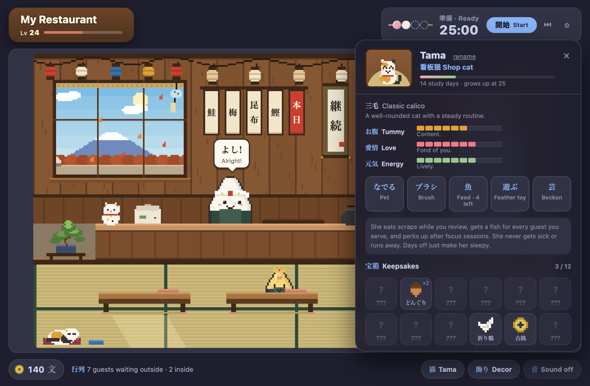
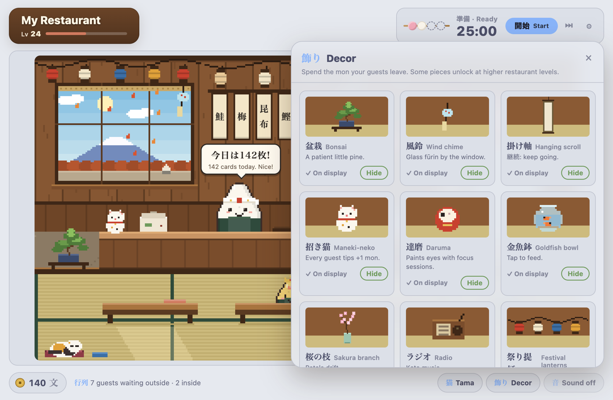

# Onigiri Kitchen · おにぎり食堂

A cozy pixel-art restaurant, pomodoro timer and shop cat for [Anki](https://apps.ankiweb.net),
built as a companion to the [Onigiri](https://ankiweb.net/shared/info/1011095603) add-on.

**You study, guests arrive. You take a break, you get to enjoy them.**


## Features

- **A living pixel restaurant.** Click Onigiri's restaurant widget and your restaurant opens: lanterns,
  noren curtain in your restaurant's theme colour, and a window onto Mt. Fuji that follows your real clock
  and the season. Everything is drawn in code, with no image files.
- **Guests come from studying.** Every 10 reviews in a deck brings a guest from that deck, and each deck
  gets its own look. Getting a leech card right sends a grumpy sour-plum guest who cheers up once fed.
  Finishing a focus session sends a golden guest.
- **Pomodoro timer.** One dango per focus session. When a break starts, the restaurant opens. When the
  break ends, you get a gentle nudge back to your cards. Long breaks are festival nights with fireworks.
  A small dango timer sits in the corner of Anki's main screens.
- **Tama, the shop cat.** A Tamagotchi-style pet with needs (tummy, love, energy) that your studying fills.
  She grows with total study days (never streaks), develops a personality from your habits, learns tricks
  and brings you gifts. **She can't get sick, run away or die.** Days off just make her sleepy.
- **Decor.** Guests tip in 文 (*mon*). Spend it on a bonsai, wind chime, maneki-neko, daruma, goldfish, radio
  and more, some unlocked by your Onigiri restaurant level.
- **Matches your Onigiri theme.** It uses your Onigiri colours, font and dark mode automatically.
- Mostly idle and fully optional: the chef, the cat, the menu tags (they play koto notes), the window, the
  lanterns and most decor all do something when clicked.

| Night & festival | Tama | Decor |
|---|---|---|
|  |  |  |

## Install

- **From AnkiWeb:** *(link coming soon)*
- **From GitHub:** download `onigiri_kitchen.ankiaddon` from the
  [latest release](https://github.com/thussenthan/onigiri-kitchen/releases/latest) and double-click it,
  or use **Tools → Add-ons → Install from file…**. Then restart Anki.

Onigiri is recommended but optional. Without it, the kitchen uses its own washi-paper theme.

**Opening the kitchen:** click the restaurant picture on Onigiri's main screen (Shift-click keeps Onigiri's
own expand view), click the shop-front icon next to Onigiri's buttons, click the corner dango timer, or use
**Tools → Onigiri Kitchen** (Ctrl+Shift+K).

## Your data

- Onigiri Kitchen **never modifies Onigiri**. It only reads your restaurant name, level, theme colours and
  font. Your XP and Taiyaki coins are untouched.
- Kitchen progress (mon, decor, guests, Tama) is saved per profile in the add-on's `user_files` folder,
  which Anki keeps across updates.
- Nothing is sent anywhere. The bug-report button only opens a pre-filled GitHub issue in your browser.

## Development

```
onigiri_kitchen/      the add-on (what gets installed)
  main.py             hooks, kitchen window, bridge commands
  state.py            save file, guests, mon, decor catalog
  pet.py              Tama's needs, growth, gifts
  pomodoro.py         wall-clock pomodoro timer
  onigiri_link.py     read-only access to Onigiri's data & theme
  web/                kitchen.js (pixel engine), chip.js (timer + widget hook), sound.js, css
dev/                  browser previews with mock data
build.sh              builds dist/*.ankiaddon and the AnkiWeb zip
```

Preview the kitchen in a browser (Anki loads scripts in `<head>`, and the preview reproduces that):

```
python3 dev/make_preview.py
python3 -m http.server 8791
# open http://localhost:8791/dev/anki_order.html?hour=21&night=1&ff=20
```

URL options: `hour`, `night`, `ff` (fast-forward seconds), `stage` (0–3), `trait`, `panel`, `phase`, `long`.

To test inside Anki, symlink or copy `onigiri_kitchen/` into your `addons21` folder and restart Anki.

## Bugs & ideas

Use **⚙ → Report a bug** in the kitchen, or [open an issue](https://github.com/thussenthan/onigiri-kitchen/issues).

## License

MIT. Onigiri is a separate add-on by its own author, and this project isn't affiliated with it.
