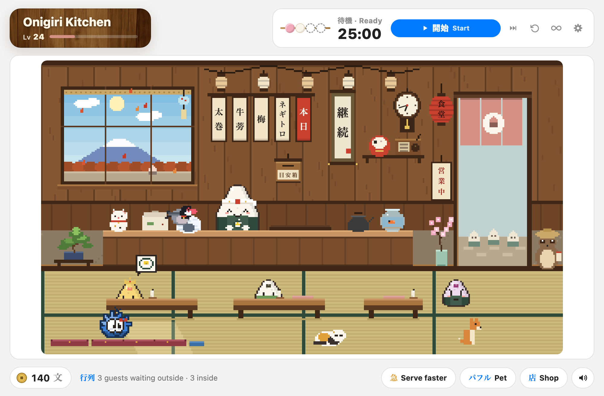
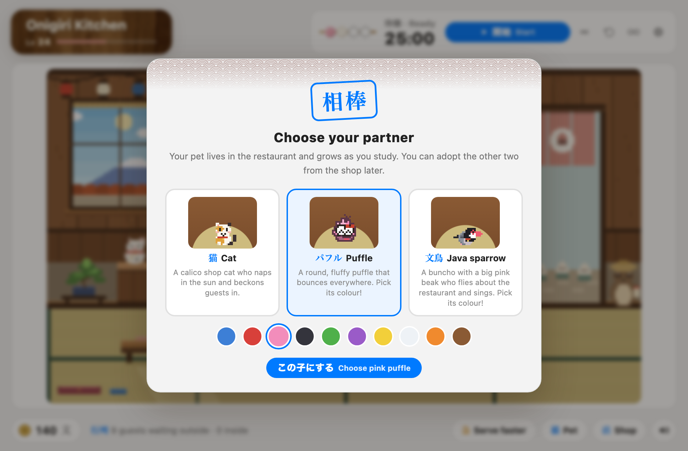
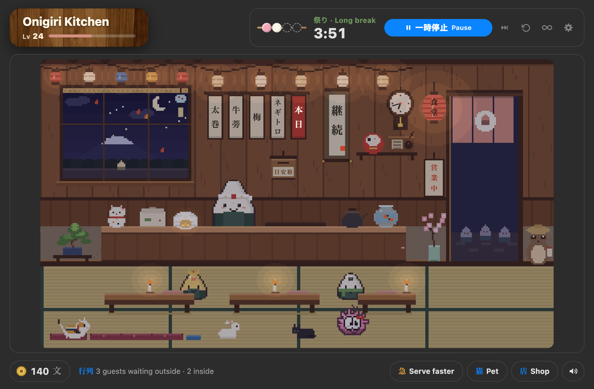
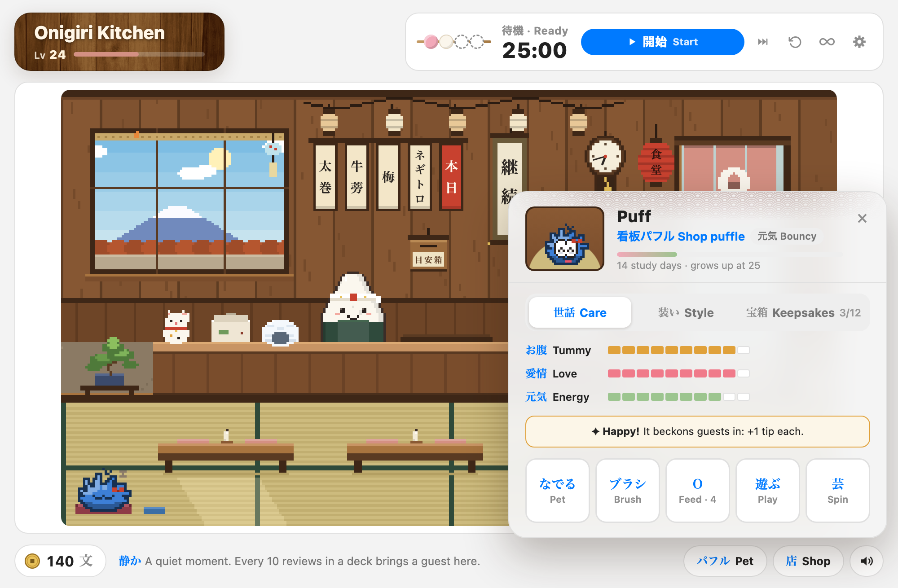
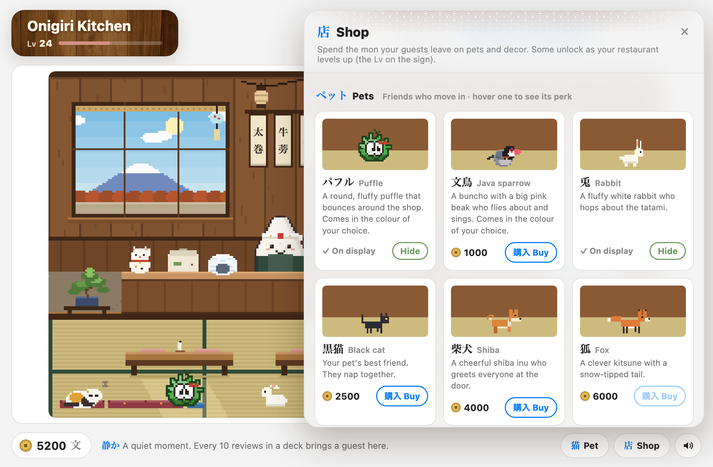
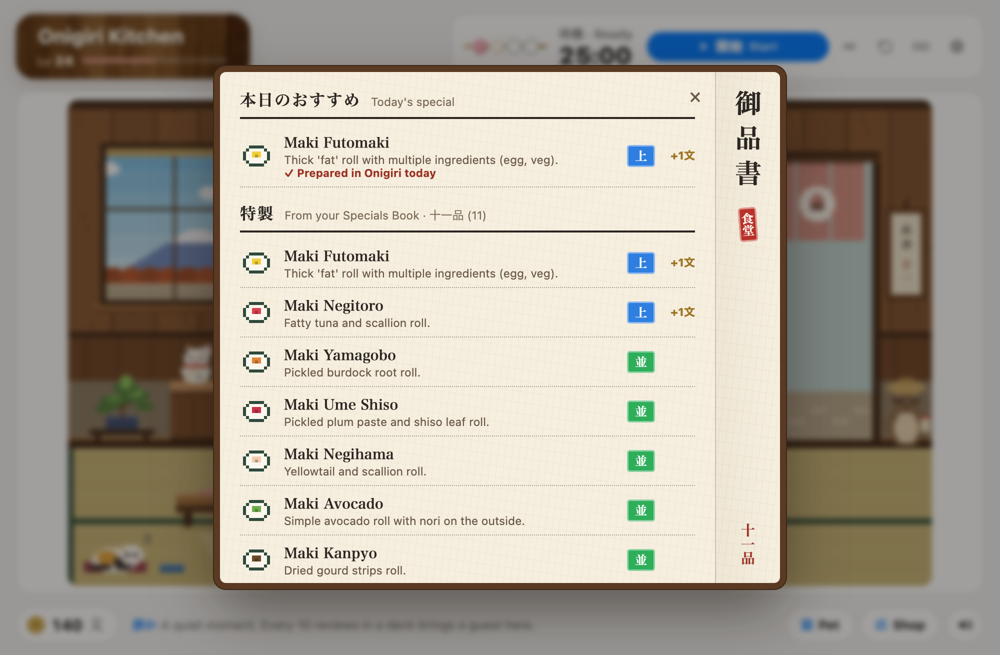
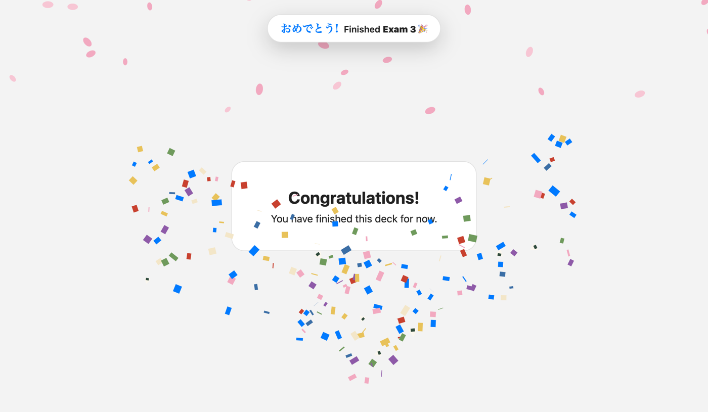
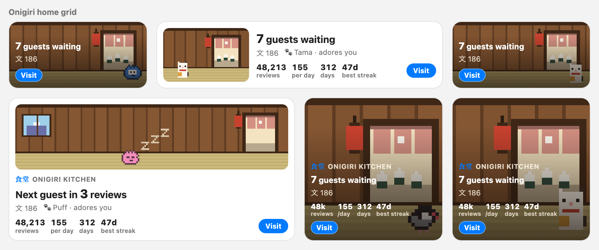

# Onigiri Kitchen · おにぎり食堂

[](https://ankiweb.net/shared/info/427107295)

A cozy pixel-art restaurant, pomodoro timer and virtual pet for [Anki](https://apps.ankiweb.net),
built as a companion to the [Onigiri](https://ankiweb.net/shared/info/1011095603) add-on.

**You study, guests arrive. You take a break, you get to enjoy them.**



## Features

- **A living pixel restaurant.** Click Onigiri's restaurant widget and your restaurant opens: lanterns,
  noren curtain in your restaurant's theme colour, and a window onto Mt. Fuji that follows your real clock
  and the season. Everything is drawn in code, with no image files.
- **Guests come from studying.** Every 10 reviews in a deck brings a guest from that deck, and each deck
  gets its own look. Getting a leech card right sends a grumpy sour-plum guest who cheers up once fed.
  Finishing a focus session sends a golden guest. Guests are counted from Anki's review log for the day, so
  reviews on your phone count too, once synced.
- **Your Onigiri Specials are on the menu.** Guests order dishes from your Onigiri Specials Book (every Daily
  Special you've finished), so the menu grows as your Book does, and golden guests order today's Daily Special.
  Rarer specials tip more (+1 mon for Uncommon up to +6 for Legendary). The chef cooks each order (tap him to make
  dishes ahead for the tray), and the menu tags on the wall show your newest specials. Collecting specials earns
  rewards: a specials board at 10 (tap it for a お品書き menu of everything the kitchen serves), a golden headband for the chef at 25, a golden frame for your first Epic and a
  legendary knife for your first Legendary. When you finish a new special, the chef announces it (and makes one)
  the next time you visit, and he cheers when your Onigiri restaurant levels up. Without Onigiri, the house onigiri flavours unlock as your restaurant levels up.
- **A daily goal party.** Reach your daily card goal (100 by default, change it in ⚙) and your restaurant throws a
  little party with fireworks the next time you visit.
- **Study in one big batch, catch up later.** There's no limit on waiting guests. After a big session you can
  serve everyone at 4× speed or collect every tip at once. Guests last until Anki's day rolls over, and anyone
  still waiting then takes takeout and still leaves a tip.
- **Pomodoro timer.** One dango per focus session. When a break starts, the restaurant opens. When the
  break ends, you get a gentle nudge back to your cards. Long breaks are festival nights with fireworks.
  A small dango timer sits in the corner of Anki's main screens. Focus only counts while you're actually reviewing:
  after 1 minute without activity it pauses (and gives that time back), then resumes on your next card.
  The ↺ button next to the timer resets the cycle. Rather study without breaks? Tap **∞ endless focus**: the clock
  counts up, no break pop-ups interrupt you, and every focus-length you study still counts as a finished session.
- **Choose your starter pet.** The first time you open the kitchen, pick a partner: Tama the cat, a puffle
  (in the colour of your choice) or a 文鳥 Java sparrow (grey, white, sakura or cinnamon, with silver and cream in
  the shop), who flies about the restaurant between perches on the
  window sill, the menu rail, the door frame, the counter, the rice cooker and any empty place at the tables. The other two can be adopted later from the shop.

  
- **Your shop pet.** A virtual pet with needs (tummy, love, energy) that your studying fills.
  Tama (or your puffle or sparrow) grows with total study days (never streaks), develops a personality from your habits, learns tricks
  and brings you gifts. **She can't get sick, run away or die.** Days off just make her sleepy.
  Caring for her pays off: keep all three needs at 70+ and she beckons guests in (+1 tip). Daily petting
  and feeding unlock accessories (collar colours, a bandana, a golden bell, a fancy cushion, a kotatsu).
  Finding all 12 keepsakes gives +500 mon and a treasure shelf, and a very happy Tama sometimes brings rare golden ones.
  The **Pet** button opens its card (Care, Style and Keepsakes tabs); double-click the name to rename it.
  Tap the bed to tuck everyone in: it grows a spot for every pet who lives with you.
- **The shop.** Guests tip in 文 (*mon*). Spend it on a bonsai, wind chime, maneki-neko, daruma, goldfish, radio
  and more, some unlocked by your Onigiri restaurant level (without Onigiri, you gain a level for every 3 days
  you've studied). The pets you didn't pick are 1,000 文 each, and extra puffle or sparrow colours 250 文.
- **Puffle extras.** Once you have a puffle, extra puffle colours (250 文 each, swap any time), an igloo lamp for
  the counter and little penguins waddling past the window (more of them in winter) switch on too.
- **More pets.** Big milestone purchases that move into the restaurant, each with a perk (hover one in the
  shop to see it): a rabbit, a black cat (your pet's best friend), a shiba, a fox, a tanuki and a red-crowned crane.
  At night and during focus sessions they all curl up on the bed.
- **A clock on real time.** A wooden wall clock, or tap it for a flip clock with split-flap digits.
- **Candles on the tables.** Click a candle to light or snuff it (with a little flame, sparks and a curl of smoke).
  The paper lanterns switch on and off together with a click. Lanterns and candles light themselves at dusk and
  go out at dawn.
- **紙吹雪 confetti and sakura petals** when you finish a deck: confetti bursts in from the sides and petals drift
  down from the top of the "Congratulations" screen, with a little fanfare.
- **Home-screen widget.** A small live pixel scene with guests waiting, mon, your pet's mood and all-time stats
  (total reviews, daily average, days studied and longest streak), plus a Visit button. With Onigiri, add it from Onigiri's layout editor. Without Onigiri, it shows under
  your decks on Anki's main screen (you can turn it off in the add-on config).
- **A guided tour** the first time you open it, which you can replay from ⚙.
- **目安箱 suggestion box** on the wall (and in ⚙) for feature ideas and bug reports.
- **Matches your Onigiri theme.** It uses your Onigiri colours, font and dark mode automatically.
- Mostly idle and fully optional: the chef, your pets, the menu tags (they play koto notes), the window, the
  lanterns, the bed and most decor all do something when clicked.

| Night & festival | Your pet | The shop |
|---|---|---|
|  |  |  |





### Pets

| Pet | Price | Needs | Perk |
|---|---|---|---|
| 兎 Rabbit | 1,500 文 | — | +5 mon for every finished focus session |
| 三毛猫 Calico cat | 1,000 文 | — | An extra treat for your pet with every guest (if you didn't start with the cat) |
| パフル Puffle | 1,000 文 | — | Your pet's energy never drops below 40 (if you didn't start with a puffle) |
| 文鳥 Java sparrow | 1,000 文 | — | Your pet's tummy never drops below 40 (if you didn't start with the sparrow) |
| 黒猫 Black cat | 2,500 文 | Lv 3 | Your pet's love never drops below 40 |
| 柴犬 Shiba | 4,000 文 | Lv 5 | +1 tip from every guest |
| 狐 Fox | 6,000 文 | Lv 10 | Sour-plum (leech) guests tip double |
| 狸 Tanuki | 9,000 文 | Lv 15 | End-of-day takeout tips are doubled |
| 鶴 Crane | 14,000 文 | Lv 20 | Every deck you finish brings a golden guest |

They're long-term goals: a review earns about 0.35 mon on average, so the rabbit takes roughly 4,000 reviews.
The full set takes about 3 months at 1,200 reviews a day, or under a year at 300 a day.

## Install

- **From AnkiWeb (recommended):** in Anki, go to **Tools → Add-ons → Get Add-ons…** and enter code
  **`427107295`** ([AnkiWeb page](https://ankiweb.net/shared/info/427107295)). You'll get updates automatically.
- **From GitHub:** download `onigiri_kitchen.ankiaddon` from the
  [latest release](https://github.com/thussenthan/onigiri-kitchen/releases/latest) and double-click it,
  or use **Tools → Add-ons → Install from file…**. Then restart Anki.

Onigiri is recommended but optional. Without it, the kitchen uses its own washi-paper theme.

**Opening the kitchen:** click the restaurant picture on Onigiri's main screen (Shift-click keeps Onigiri's
own expand view), click the shop-front icon next to Onigiri's buttons, click the corner dango timer, or use
**Tools → Onigiri Kitchen** (Ctrl+Shift+K).

## Home-screen widget



- **With Onigiri:** open Onigiri's settings, go to the main menu layout editor, find **Onigiri Kitchen · おにぎり食堂**
  in the add-on widgets list, and drag it onto your grid. Use the widget's width options in the editor to make it
  wider (2 columns looks best). It adapts to any size.
- **Without Onigiri:** it appears under your deck list automatically. Set `show_home_widget_without_onigiri` to
  `false` in **Tools → Add-ons → Onigiri Kitchen → Config** to hide it.

## Your data

- Onigiri Kitchen **never modifies Onigiri**. It only reads your restaurant name, level, theme colours and
  font. Your XP and Taiyaki coins are untouched.
- Kitchen progress (mon, decor, guests, Tama) is saved per profile in the add-on's `user_files` folder,
  which Anki keeps across updates.
- Nothing is sent anywhere. The bug-report button only opens a pre-filled GitHub issue in your browser.

## Development

```
onigiri_kitchen/      the add-on (what gets installed)
  main.py             hooks, kitchen window, bridge commands
  state.py            save file, guests, mon, decor catalog
  pet.py              the pet: species, needs, growth, gifts
  pomodoro.py         wall-clock pomodoro timer
  onigiri_link.py     read-only access to Onigiri's data & theme
  web/                kitchen.js (pixel engine), chip.js (timer + widget hook), sound.js, css
dev/                  browser previews with mock data
build.sh              builds dist/*.ankiaddon and the AnkiWeb zip
```

Preview the kitchen in a browser (Anki loads scripts in `<head>`, and the preview reproduces that):

```
python3 dev/make_preview.py
python3 -m http.server 8791
# open http://localhost:8791/dev/anki_order.html?hour=21&night=1&ff=20
```

URL options: `hour`, `night`, `ff` (fast-forward seconds), `stage` (0–3), `trait`, `panel`, `phase`, `long`.

To test inside Anki, symlink or copy `onigiri_kitchen/` into your `addons21` folder and restart Anki.

## Bugs & ideas

Click the **目安箱 suggestion box** on the restaurant wall, or use **⚙ → Suggest a feature / Report a bug**. Both
open a pre-filled GitHub issue containing only version info. You can also
[open an issue](https://github.com/thussenthan/onigiri-kitchen/issues/new/choose) directly.

## License

MIT. Onigiri is a separate add-on by its own author, and this project isn't affiliated with it.
